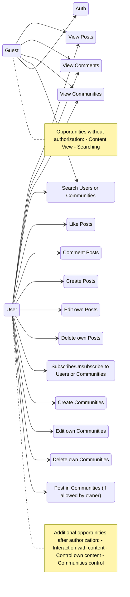

## Requirements

### Functional

1. The user can create a profile and log in.

2. The user can create and join communities.

3. Users can publish content (posts, photos, comments, likes).

4. The user can search for communities by the following criteria: name, categories, whether users can publish posts.

5. The user can search for other users and follow them, view content from communities and users they are following.

### Non-functional

1. **Performance**: The system should support up to 1000 concurrent users without performance degradation.

2. **Scalability**: The architecture should allow for easy addition of new features.

3. **Security**: User data should be validated stored in encrypted form.

4. **Availability**: The web and mobile versions should be available 24/7 with an uptime of at least 99.5%.

5. **Usability**: The interface should be intuitive and accessible to users without technical knowledge.

## Users Stories

1. As a user, I want to follow communities and users that interest me

2. As a community member, I want to post and comment on others to share experiences and knowledge

3. As a community owner, I want to give the community a name, description, avatar, choose categories, and allow or restrict subscribers from posting to it.

## Use case Diagram

